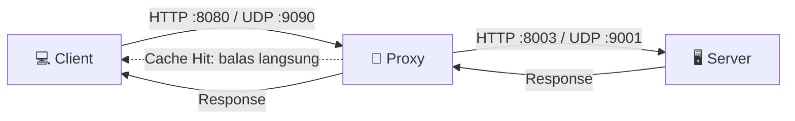

# 🌐 Tugas Besar Jaringan Komputer: Sistem Client–Proxy–Server

Implementasi sistem komunikasi jaringan **Client – Proxy – Server** menggunakan
**Python Socket Programming**. Proyek ini mendemonstrasikan komunikasi **TCP (HTTP)**
dan **UDP**, penerapan **proxy dengan caching**, **multithreading**, serta
pengukuran **Quality of Service (QoS)** pada jaringan.
---

## 📖 Deskripsi Singkat

Sistem terdiri dari tiga komponen utama yang berjalan di mesin (laptop) berbeda
dan saling terhubung melalui jaringan lokal (LAN / hotspot):

- **Server**: melayani file HTML via HTTP dan meng-echo pesan via UDP.
- **Proxy**:perantara antara client dan server, dilengkapi *caching* untuk
  mempercepat request berulang dan meneruskan trafik HTTP maupun UDP.
- **Client**: mengirim request HTTP, menguji QoS UDP, serta menjalankan
  skenario *multi-client* (uji beban simultan).

---

## 🏗️ Arsitektur Sistem



Alur kerja:
1. Client mengirim request ke **Proxy**.
2. Proxy mengecek **cache**:
   - **Cache HIT** → langsung membalas dari cache (cepat).
   - **Cache MISS** → meneruskan request ke **Server**, menyimpan hasilnya, lalu membalas ke client.
3. Untuk UDP, proxy meneruskan paket ke server dan mengembalikan response
   untuk keperluan pengukuran QoS.

---

## ✨ Fitur

- ✅ **HTTP Server** — melayani file statis dari folder `HTML/` (auto-index ke `index.html`).
- ✅ **UDP Echo Server** — membalas paket JSON dengan tambahan `server_time`.
- ✅ **Proxy dengan Caching** — menyimpan response agar request berulang lebih cepat.
- ✅ **Multithreading** — proxy & server menangani banyak koneksi secara bersamaan.
- ✅ **Pengukuran QoS** — RTT, Jitter, Packet Loss, dan Throughput.
- ✅ **Ekspor CSV** — hasil QoS otomatis disimpan ke `hasil_qos.csv`.
- ✅ **Uji Multi-Client** — mensimulasikan banyak client mengakses secara simultan.
- ✅ **Penanganan Error** — respons `502 Bad Gateway` & `504 Gateway Timeout`.

---

## 📂 Struktur Folder

```
.
├── server.py          # HTTP server + UDP echo server
├── proxy.py           # HTTP proxy (caching) + UDP proxy
├── client.py          # Client: HTTP test, UDP QoS, multi-client
├── HTML/              # File yang dilayani server
│   └── index.html
├── hasil_qos.csv      # Output pengukuran QoS (dibuat otomatis)
└── README.md
```

---

## 🛠️ Teknologi

- **Bahasa:** Python 3.x
- **Library:** `socket`, `threading`, `json`, `csv`, `mimetypes`, `os`, `time`
  (semuanya *standard library* — tidak perlu instalasi tambahan)

---

## ⚙️ Konfigurasi IP (PENTING)

Sebelum menjalankan, sesuaikan alamat IP di tiap file. Ini bagian paling sering
menyebabkan error saat dijalankan antar laptop.

| File        | Variabel           | Diisi dengan                                   |
|-------------|--------------------|------------------------------------------------|
| `server.py` | `HTTP_HOST`        | `0.0.0.0` (dengar di semua interface)          |
| `proxy.py`  | `PROXY_HOST`       | `0.0.0.0` (**jangan** diisi IP sendiri!)       |
| `proxy.py`  | `WEB_SERVER_HOST`  | IP laptop **server**, mis. `192.168.0.183`     |
| `client.py` | `PROXY_HOST`       | IP laptop **proxy**, mis. `192.168.0.109`      |

> 💡 **Cara cek IP laptop:** `ipconfig` (Windows) atau `ifconfig` / `ip a` (Linux/Mac).
> Pastikan **semua laptop terhubung ke hotspot yang sama** agar berada di subnet yang sama.

### Daftar Port

| Layanan     | Port |
|-------------|------|
| HTTP Server | 8003 |
| UDP Server  | 9001 |
| HTTP Proxy  | 8080 |
| UDP Proxy   | 9090 |

---

## 🚀 Cara Menjalankan

Jalankan **berurutan** di terminal masing-masing laptop:

### 1️⃣ Jalankan Server
```bash
python server.py
```

### 2️⃣ Jalankan Proxy
```bash
python proxy.py
```

### 3️⃣ Jalankan Client
```bash
python client.py
```

> ✅ Server & Proxy dianggap berhasil jika mencetak banner lalu **menggantung**
> (menunggu koneksi). Prompt yang tidak kembali = program berjalan normal.

### Menjalankan di 1 laptop (untuk testing cepat)
Set `WEB_SERVER_HOST` di proxy dan `PROXY_HOST` di client menjadi `127.0.0.1`,
lalu buka 3 terminal untuk server, proxy, dan client.

---

## 🎮 Cara Menggunakan Client

Setelah `client.py` dijalankan, akan muncul menu:

```
================
1 HTTP TEST
2 UDP QOS
3 MULTI CLIENT
4 EXIT
```

- **1 — HTTP TEST:** kirim request HTTP lewat proxy, tampilkan ukuran & waktu response.
- **2 — UDP QOS:** kirim sejumlah paket UDP, ukur RTT/Jitter/Loss/Throughput, simpan ke CSV.
- **3 — MULTI CLIENT:** jalankan banyak client sekaligus untuk uji beban simultan.
- **4 — EXIT:** keluar dari program.

---

## 📊 Metrik QoS yang Diukur

| Metrik          | Deskripsi                                             |
|-----------------|-------------------------------------------------------|
| **RTT**         | Round Trip Time — waktu pergi-pulang paket (ms).      |
| **Jitter**      | Variasi antar-RTT; makin kecil makin stabil (ms).     |
| **Packet Loss** | Persentase paket yang hilang (%).                     |
| **Throughput**  | Jumlah data terkirim per detik (byte/s).              |

Hasil pengujian disimpan otomatis ke `hasil_qos.csv`.

---

## 🧯 Troubleshooting

| Masalah                                             | Penyebab & Solusi                                                                 |
|-----------------------------------------------------|-----------------------------------------------------------------------------------|
| `OSError: [WinError 10049]`                         | `PROXY_HOST` diisi IP laptop sendiri. **Ganti ke `0.0.0.0`.**                      |
| `NameError: name '_name_' is not defined`           | Baris bawah harus `if __name__ == "__main__":` (**dobel** underscore).            |
| Proxy balas `502 Bad Gateway` terus                 | `WEB_SERVER_HOST` salah / server belum jalan. Cek IP server.                       |
| Client tidak bisa connect antar laptop              | Cek firewall (izinkan Python), pastikan semua di **hotspot yang sama**.           |
| `ping <IP proxy>` gagal                             | Masalah jaringan/firewall — **bukan** di kode Python.                             |
| Koneksi kampus (TelyU) tidak jalan                  | WiFi kampus sering memblokir koneksi antar perangkat. **Gunakan hotspot pribadi.**|

---

## 👥 Anggota Kelompok

| Nama                  | NIM        | Peran               |
|-----------------------|------------|---------------------|
| Jonatannael Panjaitan           | `103032430036`    | Webserver       |
| Ririn Nur Aini     | `103032400054`    | Proxyserver       |
| [Nama Anggota 3]      | `103032400036`    | Client       |

---

## 📝 Catatan / Keterbatasan

- Cache pada proxy **belum memiliki mekanisme kedaluwarsa (expiry)**. Jika file di
  server berubah, hasil lama tetap ditampilkan sampai proxy di-restart.
- Ditujukan untuk keperluan pembelajaran (tugas besar), bukan untuk lingkungan produksi.

---

<p align="center">Dibuat untuk memenuhi Tugas Besar Jaringan Komputer 🎓</p>
